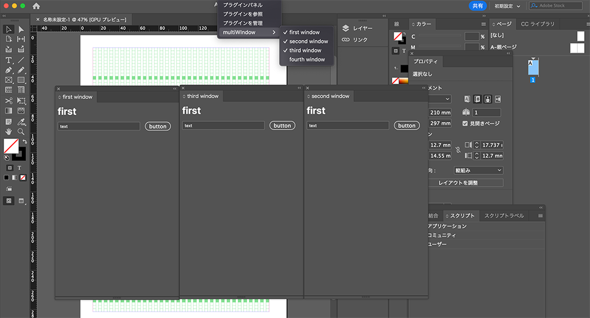
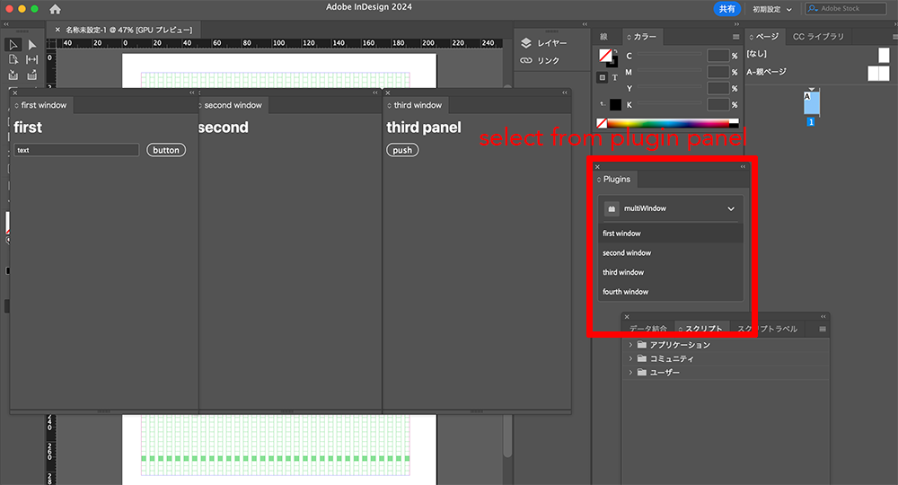

# Example of Photoshop and InDesign UXP Plugin that shows how to develop multi-panel with Vanilla JS

developing multi-UXP-Panel with Vanilla JS is bit tricky.
so I show you how to develop it.

## summary

1. write about panels on manifest.

2. call entrypoints.setup method on JS and register panels you declared on manifest.

3. on HTML any element only appeared on the panel you declared first.
   you can't see anything on other panels.

4. adding HTML element on body element through JS won't work as you image as well.

5. adding uxp-panel Web Component on HTML and writing inside of It or each panel can receive their own scope element.
see more detaills on this example.

## Note

on InDesign, you must open opnels from plugin panel. 
select from top of menu, then open panels you'll see same contents on all of panels.

select from plugin panel, it shows contents properly.

I checked on InDesign 19.2. I hope this'll be fixed soon.

## References

[Multiple panels from a single CCX?](https://forums.creativeclouddeveloper.com/t/multiple-panels-from-a-single-ccx/3049/7)

[creativeclouddeveloper forum: Manifest 5 - 2 panels in same plugin?](https://forums.creativeclouddeveloper.com/t/manifest-5-2-panels-in-same-plugin/6673/4)

[creativeclouddeveloper forum: Multiple panels without web components](https://forums.creativeclouddeveloper.com/t/multiple-panels-without-web-components/7588/7)

[alchemist code](https://github.com/jardicc/alchemist/blob/4d971ce2aa9ce851cc115a082b110227cff3f322/uxp/index.html)